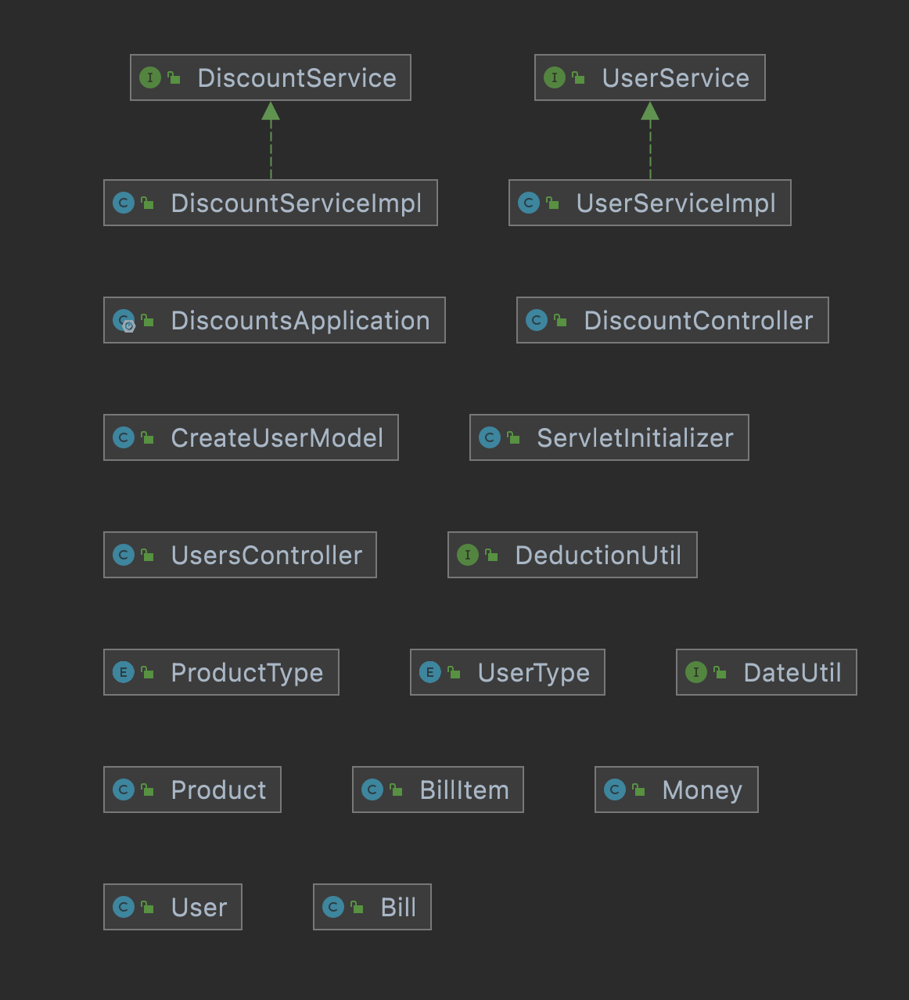

# Discounts project for interview

## Getting started

To run the application the following are pre-requisites:

* Java 11
* maven

To run the application run command `mvn spring-boot:run`. The application will run on port 8080.

An alternative is to use an IDE of choice to take advantage of in built tools of the IDE especially when running tests.

## Test Coverage

To generate test coverage run the following command:

```bash
mvn jacoco:prepare-agent test install jacoco:report
```

## Documentation

The APIs are documented using OpenAPI version 3 and swagger UI can be viwed at path `/docs.html`

## Classes

Project classes are as below:


